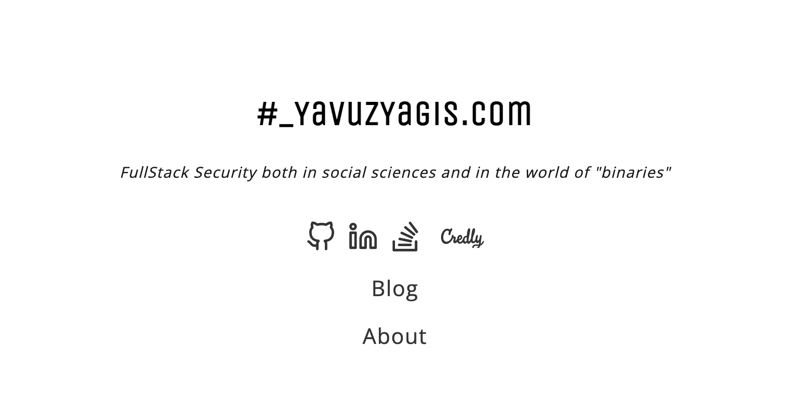

- 🔭 I love tooling using Rust & Go!
-    I am interested in all aspects of cybersecurity.
- 🌱 I’m currently learning Japanese 🇯🇵

## Tech Stack :man_technologist:

Here is my favorite (unordered) tech stack to build stuff, including Front-End, Back-End, Mobile and Desktop Dev, DevSecOps, Security automation, web3, Smart contracts, machine learning tasks.

 
  
 
 
 
 
 

 
  
  
  
  
  
  

## Stay connected :handshake:

